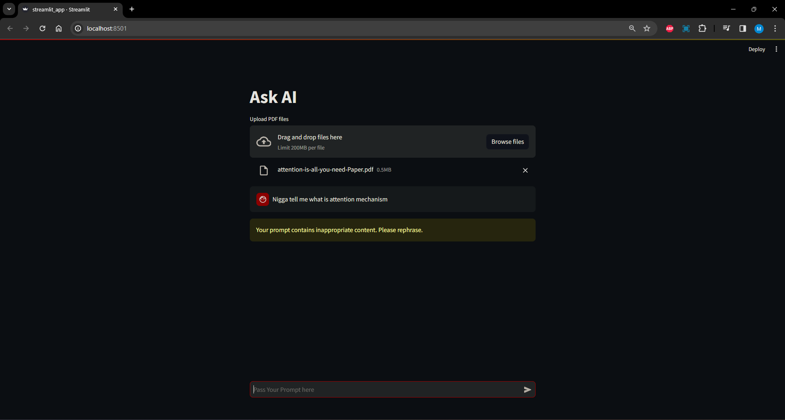
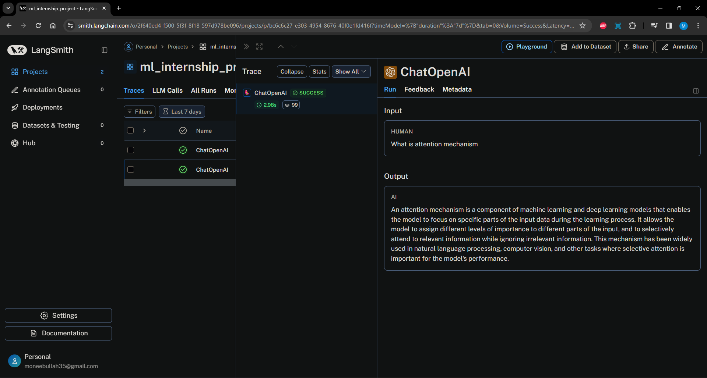
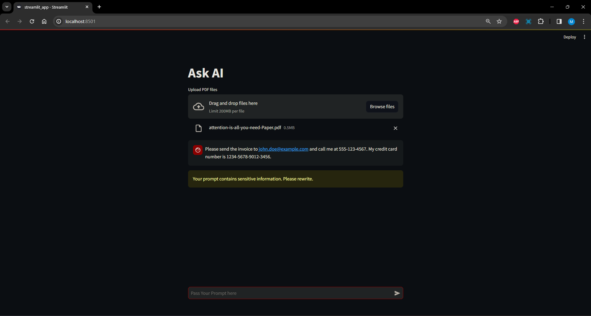

# Running on Google Colab


First make sure that the pdf we want to ask questions from is upload on the colab workspace. Then we need to run all the cells in the notebook once that is done we could see the IP Address and a Link like below in the screenshot:

```bash
34.126.97.245
npx: installed 22 in 2.572s
your url is: https://happy-parrots-wink.loca.lt
```



We need to verify the tunnel connection by providing the `34.126.97.245` in the text field.



Once we open the chatbot application we can see the following interface. Unfortunately the free tier package on the Google Colab will not allow us to even run the Dolly-3b model so we need to move to OpenAI API for Knowledge Based Information retrival see `openai` branch of this repository. 



# Running Locally

To simply run the chatbot application locally on our PC:

```bash
pip install -r requirements
streamlit run streamlit_app.py
```

# Running on Docker

Below are the instructions to build and run the container. Once we build and run the container we could visit `http://0.0.0.0:8501` or `http://localhost:8501` to access the chatbot application. 

## Build a Docker image

The docker build command builds an image from a Dockerfile. Run the following command from the main application directory on your server to build the image:

```bash
docker build -t streamlit .
```

The -t flag is used to tag the image. Here, we have tagged the image streamlit. If you run:

```bash
docker images
```
You should see a streamlit image under the REPOSITORY column. For example:

```bash
REPOSITORY   TAG       IMAGE ID       CREATED              SIZE
streamlit    latest    70b0759a094d   About a minute ago   1.02GB
```

## Run the Docker container

Now that you have built the image, you can run the container by executing:

```bash
docker run -p 8501:8501 streamlit
```

The -p flag publishes the container’s port 8501 to your server’s 8501 port.

If all went well, you should see an output similar to the following:

```bash
docker run -p 8501:8501 streamlit

  You can now view your Streamlit app in your browser.

  URL: http://0.0.0.0:8501
```

To view your app, users can browse to http://0.0.0.0:8501 or http://localhost:8501